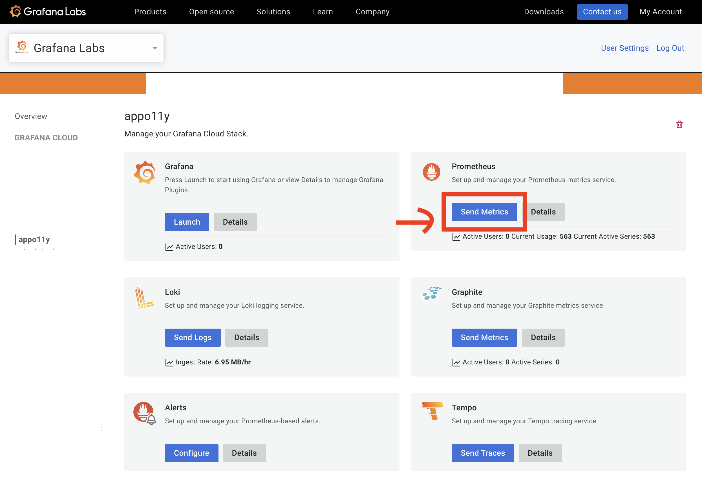
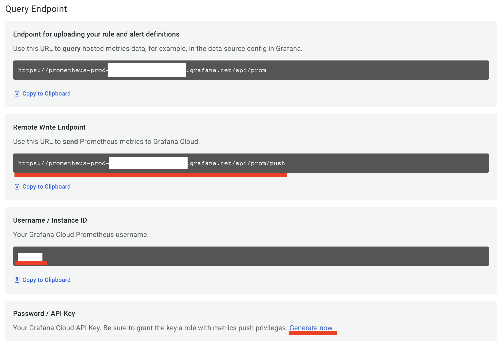
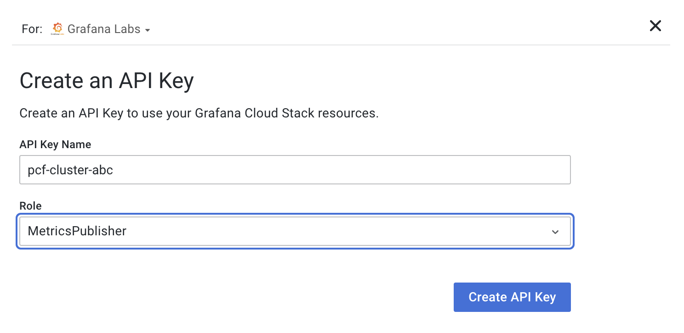

# OpenTelemetry collector deployment for PCF

## Prepare

### Download the dependency

This app depends on the OpenTelemetry collector.

```bash
./download.sh
```

### Prepare credentials for Grafana Cloud

1. go to Grafana.com to manage your account
2. select your stack
3. click "Send metrics" on the Prometheus instance


4. note down the URL for "Remote Write Endpoint" & "Username / Instance ID"


5. create a new API key with "MetricsPublisher" role in "Password / API Key" and note the API key


### Prepare credentials for CloudFoundry

For the CloudFoundry receiver, you need to provide the following environment variables. You probably
need to check with your foundation administrator.

[This page](https://github.com/open-telemetry/opentelemetry-collector-contrib/tree/main/receiver/cloudfoundryreceiver#authentication) contains instructions on how to retrieve the credentials needed from UAA.

* `RLP_GATEWAY_ENDPOINT` - URL of the RLP gateway, typically `https://log-stream.<cf-system-domain>`
* `RLP_GATEWAY_TLS_INSECURE` - `true/false` whether to skip TLS verify for the RLP gateway endpoint. Default: `false`
* `UAA_ENDPOINT` - URL of the UAA provider, typically `https://uaa.<cf-system-domain>`
* `UAA_USERNAME` - name of the UAA user (required grant types/authorities described above)
* `UAA_PASSWORD` - password of the UAA user
* `UAA_TLS_INSECURE` - `true/false` whether to skip TLS verify for the UAA endpoint. Default: `false`

## Deployment

This app is supposed to use the binary buildpack.

**Please inspect the `manifest.yml` file and adjust the variables.**

### Prepare your environment variables

We need to supply the application with some environment variables for configuration

* `GRAFANA_REMOTE_WRITE_URL` - The "Remote Write Endpoint" you noted down earlier
* `GRAFANA_USER_ID` - The "Username / Instance ID" you noted down earlier
* `GRAFANA_TOKEN` - The "Password / API Key" you noted down earlier

* `RLP_GATEWAY_ENDPOINT` - URL of the RLP gateway, typically `https://log-stream.<cf-system-domain>`
* `RLP_GATEWAY_TLS_INSECURE` - `true/false` whether to skip TLS verify for the RLP gateway endpoint. Default: `false`
* `UAA_ENDPOINT` - URL of the UAA provider, typically `https://uaa.<cf-system-domain>`
* `UAA_USERNAME` - name of the UAA user (required grant types/authorities described above)
* `UAA_PASSWORD` - password of the UAA user
* `UAA_TLS_INSECURE` - `true/false` whether to skip TLS verify for the UAA endpoint. Default: `false`

* `CF_ENV` - use this environment variable to uniquely identify a given CF environment,
  the value will be used to set the value for the `grafana.cf.cluster` attribute on all signals. Default: `unknown-env`

### Push your app

```bash
cf push grafana-pcf-monitoring
```

### Change environment variables (optional)

For every environment variable above, you can set it through the CLI.

For example:

```bash
cf set-env grafana-pcf-monitoring GRAFANA_REMOTE_WRITE_URL https://...../api/prom/push
```

## Scaling

The RLP gateway uses sharding to enable most-efficient distribution to all subscribers.

Thanks to that, you can effectively increase the number of instances that collect the metrics.

```bash
cf scale grafana-pcf-monitoring -i 5
```

## Self-Monitoring

To enable self-monitoring and achieving observabiltiy of the collector, the following metrics are collected and submitted to
the `remote_write` target as well. Queue size and memory consumption are great indicators for performance.

```prometheus
# HELP otelcol_exporter_enqueue_failed_log_records Number of log records failed to be added to the sending queue.
# TYPE otelcol_exporter_enqueue_failed_log_records counter
otelcol_exporter_enqueue_failed_log_records{exporter="prometheusremotewrite",...,service_name="otelcol-contrib",service_version="0.64.1"} 0
# HELP otelcol_exporter_enqueue_failed_metric_points Number of metric points failed to be added to the sending queue.
# TYPE otelcol_exporter_enqueue_failed_metric_points counter
otelcol_exporter_enqueue_failed_metric_points{exporter="prometheusremotewrite",...,service_name="otelcol-contrib",service_version="0.64.1"} 0
# HELP otelcol_exporter_enqueue_failed_spans Number of spans failed to be added to the sending queue.
# TYPE otelcol_exporter_enqueue_failed_spans counter
otelcol_exporter_enqueue_failed_spans{exporter="prometheusremotewrite",...,service_name="otelcol-contrib",service_version="0.64.1"} 0
# HELP otelcol_exporter_queue_capacity Fixed capacity of the retry queue (in batches)
# TYPE otelcol_exporter_queue_capacity gauge
otelcol_exporter_queue_capacity{exporter="prometheusremotewrite",...,service_name="otelcol-contrib",service_version="0.64.1"} 10000
# HELP otelcol_exporter_queue_size Current size of the retry queue (in batches)
# TYPE otelcol_exporter_queue_size gauge
otelcol_exporter_queue_size{exporter="prometheusremotewrite",...,service_name="otelcol-contrib",service_version="0.64.1"} 0
# HELP otelcol_process_cpu_seconds Total CPU user and system time in seconds
# TYPE otelcol_process_cpu_seconds counter
otelcol_process_cpu_seconds{...,service_name="otelcol-contrib",service_version="0.64.1"} 0.21000000000000002
# HELP otelcol_process_memory_rss Total physical memory (resident set size)
# TYPE otelcol_process_memory_rss gauge
otelcol_process_memory_rss{...,service_name="otelcol-contrib",service_version="0.64.1"} 8.200192e+07
# HELP otelcol_process_runtime_heap_alloc_bytes Bytes of allocated heap objects (see 'go doc runtime.MemStats.HeapAlloc')
# TYPE otelcol_process_runtime_heap_alloc_bytes gauge
otelcol_process_runtime_heap_alloc_bytes{...,service_name="otelcol-contrib",service_version="0.64.1"} 8.02343848e+08
# HELP otelcol_process_runtime_total_alloc_bytes Cumulative bytes allocated for heap objects (see 'go doc runtime.MemStats.TotalAlloc')
# TYPE otelcol_process_runtime_total_alloc_bytes counter
otelcol_process_runtime_total_alloc_bytes{...,service_name="otelcol-contrib",service_version="0.64.1"} 8.12953192e+08
# HELP otelcol_process_runtime_total_sys_memory_bytes Total bytes of memory obtained from the OS (see 'go doc runtime.MemStats.Sys')
# TYPE otelcol_process_runtime_total_sys_memory_bytes gauge
otelcol_process_runtime_total_sys_memory_bytes{...,service_name="otelcol-contrib",service_version="0.64.1"} 8.48516552e+08
# HELP otelcol_process_uptime Uptime of the process
# TYPE otelcol_process_uptime counter
otelcol_process_uptime{...,service_name="otelcol-contrib",service_version="0.64.1"} 7.917717
```
